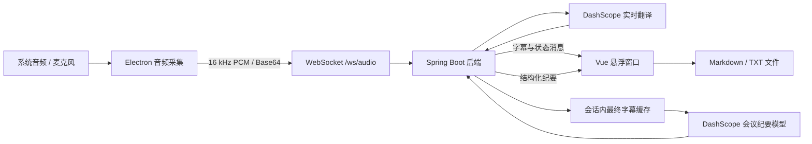

# AI Translation Assistant

AI Translation Assistant 是一个前后端分离的桌面实时翻译工具。应用通过 Electron 采集系统音频或麦克风音频，将 16 kHz PCM 音频流发送至 Spring Boot 后端，再由阿里云 DashScope 完成实时语音识别与翻译。识别完成的字幕还可以进一步生成会议纪要，并保存为 Markdown 或文本文件。

## 功能特性

- 实时展示原文字幕和中文翻译
- 支持 Windows 系统回环音频与麦克风采集
- 系统音频不可用时自动回退到麦克风
- WebSocket 断线自动重连和待发送消息缓冲
- 基于最终字幕手动生成会议纪要
- 会议纪要包含摘要、要点、决定和待办事项
- 支持将会议纪要保存为 `.md` 或 `.txt` 文件
- 无边框、透明、置顶的桌面悬浮窗口
- 提供暂停/恢复、音频源切换、连接状态和识别延迟展示

## 技术栈

| 模块 | 技术 |
| --- | --- |
| 桌面端 | Electron 42、Vue 3、TypeScript、Vite、electron-vite |
| 后端 | Java 17、Spring Boot 3.5、Spring WebSocket、Maven |
| 实时翻译 | 阿里云 DashScope Java SDK、`gummy-realtime-v1` |
| 会议纪要 | DashScope OpenAI 兼容接口、`qwen-plus` |
| 通信 | WebSocket、JSON、Base64 PCM |

## 运行环境

- Windows 10 或 Windows 11
- JDK 17
- Maven 3.9+
- Node.js 22.12+
- npm 10+
- 可用的阿里云 DashScope API Key
- 可访问 DashScope 服务的网络环境

> Electron 的 `loopback` 系统音频采集目前仅支持 Windows。其他平台可以尝试使用麦克风模式，但本项目当前以 Windows 为主要运行和验证环境。

## 快速开始

### 1. 获取 API Key

在阿里云百炼控制台创建 DashScope API Key，具体步骤参见[获取 DashScope API Key](https://help.aliyun.com/zh/model-studio/get-api-key)。

API Key 通过环境变量或安全的外部配置注入。

### 2. 启动后端

打开一个 PowerShell 窗口：

```powershell
cd D:\DeskTop\ai-translation-assistant\backend

# JAVA_HOME 必须指向本机实际安装的 JDK 17 目录
$env:JAVA_HOME = "D:\path\to\jdk-17"
$env:Path = "$env:JAVA_HOME\bin;$env:Path"

$env:DASHSCOPE_API_KEY = "你的 DashScope API Key"
mvn spring-boot:run
```

后端默认监听 `http://localhost:8080`，WebSocket 地址为：

```text
ws://localhost:8080/ws/audio
```

启动成功后，可以在另一个 PowerShell 窗口检查健康状态：

```powershell
Invoke-RestMethod http://localhost:8080/actuator/health
```

预期返回内容中包含：

```json
{
  "status": "UP"
}
```

### 3. 启动桌面端

打开另一个 PowerShell 窗口：

```powershell
cd D:\DeskTop\ai-translation-assistant\frontend
npm ci
npm run dev
```

桌面端默认连接 `ws://localhost:8080/ws/audio`。如需连接其他后端，请在启动前设置：

```powershell
$env:VITE_SUBTITLE_WS_URL = "ws://192.168.1.10:8080/ws/audio"
npm run dev
```

### 4. 使用应用

1. 应用启动后会自动连接后端并开始采集音频。
2. 默认使用“系统音频”，也可以在窗口底部切换为“麦克风”。
3. Windows 首次请求音频权限时，请允许应用访问相应设备。
4. 在“字幕”页查看原文与翻译，使用“暂停/开始”控制采集和连接。
5. 至少产生一段最终字幕后，切换到“纪要”页并点击“生成纪要”。
6. 生成完成后点击“保存纪要”，选择 Markdown 或文本格式及保存位置。

## 系统架构



核心数据流：

1. Electron 采集音频，重采样为单声道 16 kHz PCM16，并按约 100 ms 分块。
2. 前端将 PCM 数据进行 Base64 编码，通过 WebSocket 发送到后端。
3. 后端按客户端会话维护 DashScope 实时识别连接，并向前端推送字幕和连接状态。
4. 后端缓存最终字幕；用户发起生成操作后，将当前会话字幕交给会议纪要模型。
5. 前端展示结构化纪要，并通过 Electron IPC 调用本地文件保存对话框。

## 项目结构

```text
ai-translation-assistant/
├─ backend/
│  ├─ pom.xml
│  └─ src/
│     ├─ main/
│     │  ├─ java/com/ai/translation/assistant/
│     │  │  ├─ config/       # 配置属性与 WebSocket 配置
│     │  │  ├─ domain/       # 字幕、纪要与 WebSocket 消息模型
│     │  │  ├─ service/      # 实时识别、字幕分段与纪要服务
│     │  │  └─ websocket/    # 音频 WebSocket 入口
│     │  └─ resources/
│     │     └─ application.yml
│     └─ test/               # 后端单元与上下文测试
├─ frontend/
│  ├─ package.json
│  ├─ electron.vite.config.ts
│  └─ src/
│     ├─ main/               # Electron 主进程
│     ├─ preload/            # 安全 IPC 桥接
│     └─ renderer/           # Vue 界面、音频采集与 WebSocket 客户端
└─ README.md
```

## 配置说明

后端配置位于 `backend/src/main/resources/application.yml`。Spring Boot 支持使用环境变量覆盖配置，例如 `aliyun.realtime.target-language` 可以通过 `ALIYUN_REALTIME_TARGET_LANGUAGE` 覆盖。

### 基础配置

| 配置项 | 默认值 | 说明 |
| --- | --- | --- |
| `server.port` | `8080` | 后端 HTTP 与 WebSocket 服务端口 |
| `DASHSCOPE_API_KEY` | 空 | 实时翻译和会议纪要共用的 DashScope API Key |
| `VITE_SUBTITLE_WS_URL` | `ws://localhost:8080/ws/audio` | 桌面端连接的 WebSocket 地址 |

### 实时翻译

| 配置项 | 默认值 | 说明 |
| --- | --- | --- |
| `aliyun.realtime.api-key` | `${DASHSCOPE_API_KEY:}` | DashScope API Key |
| `aliyun.realtime.model` | `gummy-realtime-v1` | 实时语音识别与翻译模型 |
| `aliyun.realtime.source-language` | `en` | 源语言 |
| `aliyun.realtime.target-language` | `zh` | 目标语言 |
| `aliyun.realtime.sample-rate` | `16000` | 服务端接受的 PCM 采样率 |
| `aliyun.realtime.format` | `pcm` | 服务端接受的音频格式 |
| `aliyun.realtime.max-end-silence` | `700` | 传递给实时识别模型的最大句尾静音时长，单位毫秒 |
| `aliyun.realtime.silence-boundary-ms` | `700` | 本地静音分句边界，单位毫秒 |
| `aliyun.realtime.max-segment-duration-ms` | `3000` | 单个字幕片段的最大持续时间，单位毫秒 |
| `aliyun.realtime.final-segment-revision-grace-ms` | `1000` | 最终字幕允许修订的宽限时间，单位毫秒 |
| `aliyun.realtime.reconnect-max-attempts` | `5` | 后端连接实时服务的最大重试次数 |
| `aliyun.realtime.reconnect-initial-delay-ms` | `1000` | 后端首次重连等待时间，单位毫秒 |
| `aliyun.realtime.reconnect-max-delay-ms` | `10000` | 后端重连最大等待时间，单位毫秒 |

### 会议纪要

| 配置项 | 默认值 | 说明 |
| --- | --- | --- |
| `aliyun.minutes.api-key` | `${DASHSCOPE_API_KEY:}` | 会议纪要模型使用的 API Key |
| `aliyun.minutes.base-url` | `https://dashscope.aliyuncs.com/compatible-mode/v1` | DashScope OpenAI 兼容接口地址 |
| `aliyun.minutes.model` | `qwen-plus` | 会议纪要生成模型 |
| `aliyun.minutes.max-transcript-chars` | `12000` | 单次生成纪要使用的最大字幕字符数，超出时保留末尾内容 |
| `aliyun.minutes.timeout-ms` | `30000` | 会议纪要请求超时时间，单位毫秒 |

修改源语言或音频参数时，需要同时确认所选 DashScope 模型支持该配置。当前前端固定发送 16 kHz PCM，因此不要单独修改后端采样率或格式。

## WebSocket 协议概览

服务端点：

```text
GET ws://localhost:8080/ws/audio
```

客户端发送的消息：

| 消息类型 | 用途 |
| --- | --- |
| `audio.chunk` | 发送 Base64 编码的 16 kHz PCM16 音频块 |
| `audio.silence` | 通知后端当前会话达到静音分句边界 |
| `minutes.generate` | 使用当前会话已缓存的最终字幕生成会议纪要 |

服务端推送的消息：

| 消息类型 | 用途 |
| --- | --- |
| `subtitle.update` | 推送原文、翻译、片段版本、最终状态与延迟 |
| `realtime.status` | 推送实时识别服务的连接、完成或错误状态 |
| `minutes.update` | 推送纪要生成状态和结构化纪要内容 |

`audio.chunk` 的关键约束：

```json
{
  "type": "audio.chunk",
  "sessionId": "客户端生成的 UUID",
  "timestamp": 1710000000000,
  "sampleRate": 16000,
  "format": "pcm",
  "data": "Base64 编码的 little-endian PCM16 数据"
}
```

所有消息均为 JSON 文本帧。`sessionId` 用于关联实时识别、最终字幕缓存和会议纪要；参数、JSON 或 Base64 数据无效时，后端会以 `BAD_DATA` 关闭连接。

## 开发与验证

### 后端

```powershell
cd backend
mvn test
mvn package
```

后端构建产物位于 `backend/target/`。

### 前端

```powershell
cd frontend
npm run typecheck
npm run build
npm run preview
```

`npm run build` 会执行 TypeScript 类型检查并生成 Electron 主进程、预加载脚本和渲染页面，产物位于 `frontend/out/`。

当前项目尚未配置 `electron-builder`、`electron-forge` 等安装包工具，因此前端构建不会生成 `.exe`、安装程序或便携发行包。

## 常见问题

### Maven 提示 `JAVA_HOME environment variable is not defined correctly`

确认 `JAVA_HOME` 指向 JDK 根目录，而不是 `bin` 目录：

```powershell
$env:JAVA_HOME = "D:\path\to\jdk-17"
$env:Path = "$env:JAVA_HOME\bin;$env:Path"
java -version
mvn -version
```

两条版本命令都应显示正在使用 Java 17。

### 界面显示“连接失败”或“未连接”

依次检查：

1. 后端是否已在 `8080` 端口启动。
2. `http://localhost:8080/actuator/health` 是否返回 `UP`。
3. `VITE_SUBTITLE_WS_URL` 是否与后端地址一致。
4. 防火墙、代理或反向代理是否允许 WebSocket 升级。
5. 前后端不在同一台机器时，后端端口是否可从客户端访问。

### 字幕提示实时识别服务不可用

确认已在启动后端的同一个 PowerShell 会话中设置 `DASHSCOPE_API_KEY`，并检查 API Key 权限、账户额度、网络和模型配置。

### 系统音频没有声音

- 系统回环音频仅在 Windows 上受 Electron 官方支持。
- 确认系统正在播放声音，且未将应用或输出设备静音。
- 尝试切换到“麦克风”确认采集链路是否正常。
- 系统音频采集失败时，应用会自动尝试回退到麦克风模式。

### 无法生成会议纪要

- 必须先产生至少一段最终字幕，“生成纪要”按钮才可用。
- 会议纪要与实时翻译共用 `DASHSCOPE_API_KEY`。
- 检查 `qwen-plus` 是否可用，以及 DashScope OpenAI 兼容接口是否可访问。
- 关闭 WebSocket 或退出应用后，当前会话的字幕缓存会被清理。

## 当前限制

- 实时识别会话、最终字幕和会议纪要生成状态仅保存在后端内存中。
- WebSocket 连接关闭后，对应会话数据会被清理，不支持历史记录恢复。
- 当前没有数据库、用户系统、权限控制或多设备会话同步。
- 系统音频采集以 Windows 为主要支持平台。
